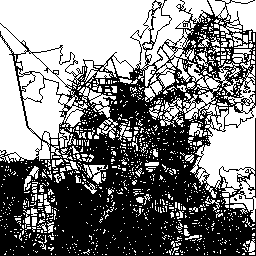

# Rust OSM Renderer (Vulkan)

This repo contains a hardware-accelerated OSM tile renderer written in Rust using Vulkan. Its goal is to perform headless, high-performance rendering of OpenStreetMap data to PNG tiles with minimal operational overhead.

This is a complete rewrite of the [Go + OpenGL implementation](https://github.com/nielsole/go-gl-osm) to address OpenGL thread affinity issues and leverage Vulkan's better multi-threading support.

## Vision

Rasterized maps offer compelling advantages: they work on any device, deliver excellent performance, run easily offline, integrate seamlessly with slippy map interfaces, and can display rich cartographic detail. While they lack the interactivity of vector tiles, their information density and visual clarity make them ideal for traditional mapping. Yet traditional OSM rendering infrastructure remains anchored to single-server architectures that rely heavily on pre-rendering and caching because real-time rendering—especially at lower zoom levels—is prohibitively expensive.

This project challenges that paradigm through two key innovations:
1. **Application-specific data layout**: Spatial indexing and memory-mapped data structures optimized specifically for tile rendering
2. **Hardware-accelerated rendering**: GPU-based rendering pipeline leveraging modern Vulkan APIs

The goal is to make dynamic, on-demand tile rendering feasible without caching, while enabling horizontal scaling across multiple servers.

**Target Use Case: Detail-Rich Traditional Maps**

This renderer targets traditional cartography—detailed maps that empower users to navigate and develop spatial awareness. Unlike mobility apps (Google Maps, navigation services) that prioritize route guidance and real-time traffic, traditional maps emphasize:
- Rich cartographic detail and visual hierarchy
- Comprehensive feature representation (buildings, landuse, natural features)
- Spatial context and orientation
- Offline capability and user control

This combination—on-demand rendering performance + traditional map detail + user empowerment—is what sets this project apart and justifies its existence.

## Features

- **Vulkan-based rendering**: Headless GPU-accelerated tile rendering
- **Zero-copy data access**: Memory-mapped OSM data for efficient processing
- **GPU-side projection**: Web Mercator projection computed in vertex shader
- **Async HTTP server**: Built with Tokio + Axum for concurrent request handling
- **Spatial indexing**: Tile-based quadtree for fast lookups (zoom levels 0-15)
- **Binary serialization**: Go-compatible data format for cross-validation

## Architecture

```
OSM PBF File → Spatial Index → Memory-Mapped Binary
                                        ↓
HTTP Request → Tile Lookup → Vulkan Renderer → PNG → Response
                              (GPU accelerated)
```

**Key Components:**
- **Data Pipeline**: OSM parsing, spatial indexing, memory mapping
- **Vulkan Renderer**: Graphics pipeline with line topology, GLSL 450 shaders
- **HTTP Server**: Axum web server with thread-local Vulkan contexts
- **PNG Encoding**: Parallel image encoding

## Current Status

✅ **Complete:**
- Vulkan initialization and headless rendering
- Graphics pipeline with GPU-side Mercator projection
- Memory management with gpu-allocator
- HTTP server with async request handling
- Binary serialization (Go-compatible format)
- Memory-mapped zero-copy data access
- Project compiles successfully

⚠️ **Known Limitation:**
The `osmpbf` crate (v0.3) provides Way elements with node IDs only, not coordinates. To use this renderer, OSM data must be pre-processed with `osmium`:

```bash
osmium add-locations-to-ways input.osm.pbf -o prepared.osm.pbf
```

Alternatively, the OSM loader needs to be updated to resolve node coordinates in a two-pass approach.

## Example Output

Current rendering capability demonstrated with Hamburg, Germany (tile 11/1081/660):



**Current State: EXTREMELY BASIC**

The renderer is in very early stages and only produces black lines on a white background. This is nowhere near the capability of established renderers like Mapnik, Mapbox, or even simple Leaflet styles.

What's working:
- Raw road geometry rendering (black lines only)
- Vulkan headless rendering pipeline
- Web Mercator projection on GPU
- Memory-mapped data access

What's completely missing (i.e., what every real map renderer has):
- Any styling whatsoever (colors, widths, road classifications)
- Water bodies, parks, buildings, landuse polygons
- Labels, text rendering, icons
- Zoom-dependent feature filtering
- Road classification (highways vs residential streets)
- Multiple layers and z-ordering
- Anti-aliasing and visual polish
- Pretty much everything that makes a map usable

This is essentially a proof-of-concept that the Vulkan pipeline can draw lines. It's not a production-ready renderer by any measure.

## Prerequisites

- **Rust**: 1.88 or later (due to osmpbf dependency)
- **Vulkan**: Compatible GPU and drivers
  - Linux: `vulkan-tools`, `libvulkan-dev`
  - Verify with: `vulkaninfo`
- **OSM Data**: Pre-processed PBF file with resolved node locations

## Installation

```bash
# Clone the repository
git clone <repo-url>
cd rust-osm-renderer

# Build (release mode for performance)
cargo build --release

# The binary will be at target/release/rust-osm-renderer
```

## Usage

```bash
# Basic usage
./target/release/rust-osm-renderer prepared.osm.pbf

# The server will start on http://0.0.0.0:8080
# Access tiles at: http://localhost:8080/tile/{z}/{x}/{y}.png
```

**Example:**
```bash
# Download OSM data for a city (e.g., Hamburg)
wget https://download.geofabrik.de/europe/germany/hamburg-latest.osm.pbf

# Pre-process with osmium
osmium add-locations-to-ways hamburg-latest.osm.pbf -o hamburg-prepared.osm.pbf

# Run the renderer
./target/release/rust-osm-renderer hamburg-prepared.osm.pbf
```

**Tile URL Format:**
```
http://localhost:8080/tile/{z}/{x}/{y}.png
```

Example: `http://localhost:8080/tile/0/0/0.png` (world overview at zoom 0)

## Configuration

Currently configured via source code constants:
- **Tile size**: 256x256 pixels
- **Port**: 8080
- **Max zoom**: 15
- **Temp file**: `/tmp/rust-osm-renderer-data.bin`

## Performance

**Expected improvements over Go + OpenGL:**
- 1.5-2x throughput increase (concurrent tile rendering)
- Lower tail latencies (no GC pauses)
- Better CPU utilization (Vulkan's multi-threading support)

**Optimizations:**
- Memory-mapped I/O (zero-copy data access)
- GPU-side Web Mercator projection
- Pre-allocated vertex buffers
- Thread-local Vulkan contexts (one per CPU core)
- Parallel PNG encoding

## Development

**Project Structure:**
```
rust-osm-renderer/
├── src/
│   ├── data/           # OSM data loading, serialization, spatial indexing
│   ├── renderer/       # Vulkan rendering, pipeline, memory management
│   ├── server/         # HTTP server and request handlers
│   ├── encoding/       # PNG encoding
│   ├── projection.rs   # Mercator projection utilities
│   └── main.rs         # Entry point
├── shaders/            # GLSL shaders (compiled to SPIR-V at build time)
└── build.rs            # Shader compilation
```

**Running tests:**
```bash
cargo test
```

**Enabling validation layers (debug):**
```bash
# Install validation layers
sudo apt-get install vulkan-validationlayers

# Build in debug mode (validation layers enabled automatically)
cargo build
```

## Viewing Tiles

You can view rendered tiles using the Leaflet.js viewer from the Go project:

1. Copy the `static/` directory from the Go project to the Rust project root
2. Start the server
3. Open `http://localhost:8080/static/index.html` in your browser

## Migration from Go

This Rust implementation maintains binary compatibility with the Go version's data format, allowing cross-validation of rendered output.

**Key differences:**
- **Rendering**: Vulkan instead of OpenGL
- **Concurrency**: Thread-local Vulkan contexts instead of single render loop
- **Memory management**: Explicit with gpu-allocator instead of Go's GC
- **Threading**: No main thread locking required (Vulkan is thread-safe)

## Known Issues & Future Work

1. **OSM Data Loading**: Need to implement node coordinate resolution
   - Option 1: Two-pass node resolution in memory
   - Option 2: Switch to `osm` crate with full coordinate support
   - Option 3: Require pre-processed OSM data (current workaround)

2. **Performance Tuning**: Additional optimizations possible
   - Multi-buffering for GPU/CPU parallelism
   - Pipeline caching for faster startup
   - Descriptor set pooling

3. **Features**: Could add from Go version
   - TLS support
   - Custom host/port configuration
   - Configurable zoom levels
   - Road coloring by type

## License

[Specify license]

## Credits

- Original Go implementation: [go-gl-osm](https://github.com/nielsole/go-gl-osm)
- OSM data: [OpenStreetMap](https://www.openstreetmap.org/) contributors, [CC-BY-SA](https://creativecommons.org/licenses/by-sa/2.0/)
- Vulkan: Khronos Group
- Rust ecosystem: ash, gpu-allocator, tokio, axum, osmpbf, image

## Contributing

This is an experimental project. Contributions welcome, especially for:
- Resolving OSM coordinate loading
- Performance optimizations
- Additional features

## Troubleshooting

**"No suitable physical device found"**
- Ensure Vulkan drivers are installed: `vulkaninfo`
- Check GPU compatibility

**"Failed to compile shaders"**
- Ensure `shaderc` is installed: `sudo apt-get install libshaderc-dev`

**"Memory mapping failed"**
- Check disk space in `/tmp/`
- Ensure temp file can be created

**Build errors with osmpbf**
- Update Rust: `rustup update` (requires 1.88+)
